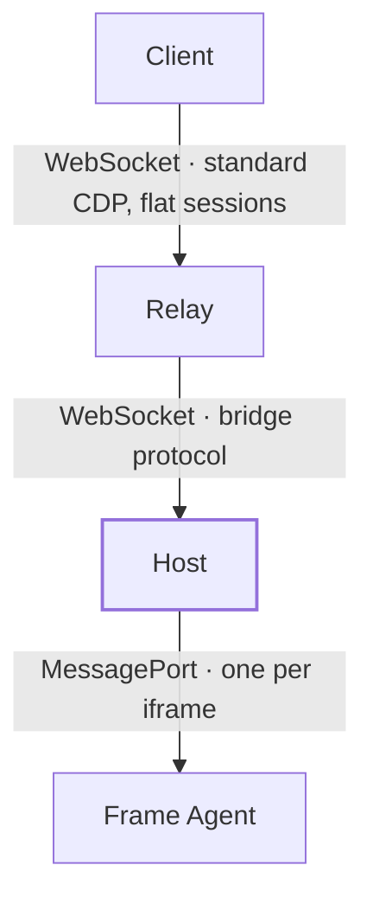
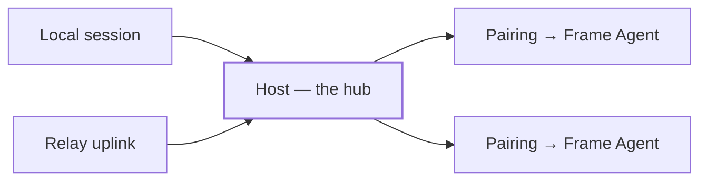

# Architecture

icdp delivers the Chrome DevTools Protocol across an iframe boundary. A standard CDP tool drives and inspects an app embedded in an iframe — including a cross-origin one — without any real browser debugging session. Nothing in the chain speaks to a browser's remote-debugging port; page JavaScript emulates the CDP domains against the live DOM, and the rest of the system carries protocol frames to and from that page.

This page describes the four pieces, the vocabulary that runs through all of them, and the one design decision that shapes everything: the [Host](/explanation/concepts) is the hub, not the Relay. For the recipes that put these pieces together, follow the [how-to guides](/guides/); for the precise machinery of each module, read the [reference](/reference/).

## The four pieces

Four components sit on a line, each its own package entry point:

The [**Frame Agent**](/explanation/concepts) runs inside the embedded app. It emulates CDP domains against the real DOM and is the party that ultimately executes commands. The embedded app ships the agent itself — the Host never injects it. On boot the agent announces a `hello` to the parent and then stays dormant unless the parent's origin is on its allowlist. See [Embed the Frame Agent](/guides/embed-the-frame-agent) and the [Frame Agent reference](/reference/frame).

The [**Host**](/explanation/concepts) is parent-window code that pairs with Frame Agents and fans CDP sessions out to consumers. It owns the per-iframe MessagePort channels and the protocol bookkeeping. See the [Host reference](/reference/host).

The [**Relay**](/explanation/concepts) is the server. It exposes a Chrome-compatible CDP endpoint that external tools attach to over WebSocket, and it serves exactly one Host at a time — a newly connecting Host takes over from a stale one (new-wins). See [Run a Relay](/guides/run-a-relay) and the [Relay reference](/reference/relay).

The [**Client**](/explanation/concepts) is an external CDP-speaking tool: agent-browser, chrome-remote-interface, or Playwright (best-effort). It connects to the Relay and speaks plain CDP; it never learns that the thing on the other end is an iframe rather than a browser tab.

Because each piece is its own subpath specifier, you take only what a given process needs: the app imports `@olimsaidov/icdp/frame`, the parent window imports `@olimsaidov/icdp/host`, and a server imports `@olimsaidov/icdp/relay/node`. The shared message shapes and constants live in `@olimsaidov/icdp/protocol`.

## Target, Pairing, Session

Three nouns describe how a Client sees an iframe and how the Host tracks it. They are not interchangeable.

A [**Pairing**](/explanation/concepts) is the Host-side slot an iframe occupies, created by `host.pair(iframe, { targetId, origins })`. A [**Target**](/explanation/concepts) is that same Pairing as a Client sees it. A [**Session**](/explanation/concepts) is one Client's attachment to one Target, identified by a `sessionId`; one Client connection can hold sessions to many Targets at once.

The distinction that matters is where target identity lives. It belongs to the Pairing, not to the iframe element or its current document. Reloads, remounts, and cross-app navigations keep the same `targetId` — surfaced to Clients as `Page.frameNavigated` — and only the Host destroying the Pairing (via `unpair`) destroys the Target. A document dying does not end the Target; it fails the commands that were in flight against that document (with CDP error code `-32000`) and waits for the next `hello`. This is why the [target lifecycle](/explanation/target-lifecycle) is a property of the slot, not the page.

## The inversion: the Host is the hub

The natural way to build this is server-centric. The in-page agent dials the server directly, and even a console panel in the parent window consumes CDP by looping out through the server and back: browser → server → browser. The server is the hub; everything else is a spoke that must reach it.

icdp inverts that. The Host owns the Frame Agent channels and fans sessions out to consumers, and the Relay uplink is structurally just one consumer among others — opened with `connectRelay`, dropped with the disconnect function it returns, and otherwise indistinguishable from a local attachment.

A local console panel and the Relay uplink are the *same kind of thing* to the Host: both are consumers of the same fan-out. The Relay is not privileged; it is one more attachment that happens to bridge to the network.

Two properties fall out of putting the Host at the center:

- **Parent-window code gets a local, server-free CDP tap.** `host.attach(targetId)` returns a `LocalSession` with no Relay in the path. A console panel built on a local session keeps working with the Relay down, because the Relay was never load-bearing for it — see [Build a local console panel](/guides/local-console-panel).
- **The Host and Frame Agent are testable in a browser with no server.** The whole DOM-facing half of the system — pair, handshake, dispatch, event delivery — exercises end to end against a local session, so the Relay and its WebSocket transport are not on the critical path of those tests.

The cost is that the Host cannot be a dumb pipe. With multiple consumers attached to the same Target, it has to do real session fan-out: every frame event broadcasts to all attached sessions (each local session's listeners and the uplink alike), and domain enables are ref-counted per Target. The Relay's `Runtime.enable` and a local panel's `Runtime.enable` coexist as two holders of the same domain; a `Runtime.disable` is forwarded to the Frame Agent only when the last holder releases it. A naive pipe would either double-enable or let one consumer's disable blind another. This bookkeeping is the price of the inversion, and it lives entirely in the Host (`dispatch`, `releaseEnables`).

There is one deliberate exception to "the Relay is just a consumer." Registry methods — `Target.getTargets`, `Target.attachToTarget`, `Target.setAutoAttach`, and their kin — read the Relay's own session and target state, so they stay Relay-owned and never reach the Host. Only the `Target.createTarget` / `Target.closeTarget` lifecycle can be delegated back to the Host, and only when it opts in by setting `onCreateTarget` / `onCloseTarget` and advertising those methods in its ready handshake. See [client-driven targets](/guides/client-driven-targets).

## One command, end to end

Follow a single command from a Client to the DOM and back. Take `DOM.getDocument` issued on a Session already attached to a Target.

1. **Client → Relay.** The Client sends the CDP request over its one WebSocket connection to the browser-level endpoint, tagging it with the `sessionId` of its Session. There is no per-target socket; the [flat-session protocol](/explanation/flat-session-protocol) multiplexes every Target over that single connection, and the `sessionId` is how the Relay knows which Target the command is for.

2. **Relay → Host.** The Relay resolves the `sessionId` to a Target and forwards the command to the Host over the bridge WebSocket as a `command` frame carrying the `targetId`, `sessionId`, request `id`, method, and params. Registry and housekeeping methods would have been answered by the Relay itself here; a domain command like this one passes through.

3. **Host → Frame Agent.** The Host routes the command to the matching Pairing (`dispatchTo`), assigns its own monotonic command id, records the pending call keyed by the consumer (`relay-<sessionId>`), applies enable ref-counting if the method is an `.enable` or `.disable`, and posts the JSON request over that Pairing's MessagePort. If the Pairing has no live channel — the agent has not paired yet — the command fails fast rather than queueing.

4. **Frame Agent executes.** The agent receives the request on its port and dispatches it through [chobitsu](https://github.com/liriliri/chobitsu) plus icdp's registered domain handlers, which read and write the real DOM. `DOM.getDocument` walks the live document; `Runtime.evaluate` runs indirect eval in the page's single execution context. The result is posted back over the port as a CDP response carrying the Host's command id.

5. **Back to the Client.** The Host matches the response to its pending call, settles it, and the uplink sends a `response` frame to the Relay tagged with the original `sessionId` and request `id`. The Relay writes it to the Client's socket. Frame-initiated events take the same path in reverse without a request id, fanning out from the Host to every Session attached to that Target.

A local console panel that called `host.attach(...).send("DOM.getDocument")` takes the identical Host-and-below route; steps 1–2 and 5's outer hop simply do not exist for it. That symmetry is the whole point of the inversion: the Relay path and the local path converge at `dispatch`.

## Why cooperative embedding

The Frame Agent is shipped by the app under automation, not injected by the Host. That is what makes cross-origin work.

A parent window cannot reach into a cross-origin iframe's document — the same-origin policy forbids reading or scripting it. So the Host cannot inject a driver, and it does not try. Instead the embedded app includes `startFrameAgent` itself, which runs with full same-origin access to its own DOM. The Host and the agent then meet only at the boundary the browser does permit: `window.postMessage` for the `probe` / `hello` / `welcome` handshake, after which a transferred `MessagePort` carries CDP frames. Neither side ever touches the other's document directly.

Cooperative embedding is also the security model. The agent stays dormant — it announces but adopts no channel — unless the parent origin is in its `allowedParents`, and the Host only sends a `welcome` to a frame whose origin is in the Pairing's `origins` allowlist. Both ends must consent before any command flows.

::: warning
`allowedParents: "*"` hands DOM read, write, and eval to any embedder. Use it only for pages that are themselves sandboxed or throwaway.
:::

## Where to read next

- [The flat-session protocol](/explanation/flat-session-protocol) — why every Target rides one WebSocket and how `sessionId` routing works.
- [The target lifecycle](/explanation/target-lifecycle) — how a Target survives reloads and navigations while a document does not.
- [Concepts](/explanation/concepts) — the canonical definitions of every term used above.
