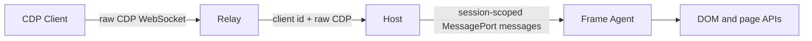

# Architecture

icdp exposes a Chromium-shaped CDP endpoint for cooperative iframe
applications. It does not connect to Chromium's DevTools backend. The Frame
Agent uses page APIs against its own document, while the Host supplies the
Target and Session model expected by CDP clients.


```mermaid
flowchart LR
    C["CDP Client"] -->|"raw CDP WebSocket"| R["Relay"]
    R -->|"client id + raw CDP"| H["Host"]
    H -->|"session-scoped MessagePort messages"| F["Frame Agent"]
    F --> D["DOM and page APIs"]
```

## Ownership

The boundaries follow the state:

- The **Frame Agent** owns document-facing behavior. It has one shared
  `FrameBackend` for the document and one isolated `FrameSession` per CDP
  Session. Frontend DOM ids, Runtime object handles, enabled domains, input
  state, responses, and events are Session-scoped.
- The **Host** is the sole DevTools-session owner. It owns Pairings, Targets,
  CDP Clients, flat Sessions, browser/Target commands, each Session's Target
  agent, and each Session's enabled-domain set. Child-Session ownership and
  Target discovery/auto-attach state are scoped to the Target agent that made
  the request. The Host is also the only component allowed to create or
  destroy an iframe Target.
- The **Relay** is transport and discovery only. It assigns an opaque id to
  each Client socket, carries raw CDP messages between that Client and the
  Host, and caches the Host's Target summaries for `/json` routes. It does not
  parse commands, mint Sessions, or fan out events.
- A **Client** can use the browser WebSocket with Chromium's flat-session
  protocol or one Target's direct WebSocket. It does not need to know that a
  Target is an iframe.

Parent-window code can skip the Relay and call `host.attach(targetId)`. That
creates the same kind of isolated Session used for a remote Client.

## The three wire boundaries

The Frame Agent first announces itself with `window.postMessage`. After both
origin allowlists accept the pairing, the Host transfers a `MessagePort`.
Messages on that port are explicit:

```ts
// Host -> Frame
{ kind: "attach", sessionId, state: { enabledDomains, domainParams } }
{ kind: "command", sessionId, id, method, params }
{ kind: "detach", sessionId }

// Frame -> Host
{ kind: "response", sessionId, id, result }
{ kind: "event", sessionId, method, params }
```

The Host–Relay WebSocket is simpler still. The Relay sends a complete Client
id snapshot plus `{ kind: "clientMessage", clientId, message }` frames. The
Host sends Target-summary changes and raw Client responses in the same
`clientMessage` envelope.

The outer Client WebSocket carries ordinary CDP JSON.

## One command

For a remote `DOM.getDocument` over the browser endpoint:

1. The Client sends a CDP command with the `sessionId` returned by
   `Target.attachToTarget`.
2. The Relay tags the unchanged JSON with the Client id and forwards it.
3. The Host validates the CDP envelope and Session ownership, assigns a
   Pairing-local command id, and sends a session-scoped Frame command.
4. The Frame Session serializes the live document using that Session's DOM id
   registry and returns a session-scoped response.
5. The Host restores the Client's original request id and the Relay writes the
   JSON only to that Client socket.

Events follow the same ownership. The Frame Agent emits an event to one
Session; the Host routes it to that Session's local listener or remote Client.
There is no Target-wide broadcast.

On a direct Target endpoint, the Host creates one implicit Session for the
socket. Root Page-domain commands and events omit `sessionId`, as they do in
Chromium. Explicit nested flat Sessions remain available and retain their
`sessionId`.

## Reloads

`targetId` belongs to the Host Pairing, not to a document. On a new Frame
Agent handshake the Host keeps the Target and Sessions, fails commands still
in flight against the old document, opens a fresh port, and re-sends one
`attach` message per Session with its enabled domains and accepted enable-time
parameters. The new Frame Sessions recreate their DOM and Runtime identity
spaces before work resumes.

## Why embedding is cooperative

A parent cannot script a cross-origin iframe. The embedded app therefore
imports and starts the Frame Agent itself. The Host and agent communicate only
through `postMessage` and the transferred port; neither reads the other's
document.

Both sides apply an origin allowlist. `allowedParents: "*"` grants any
embedder DOM read/write and Runtime evaluation in the framed origin and should
only be used for disposable or separately sandboxed pages.

## Native limits

The method names and wire shapes follow current Chromium CDP where the page
platform can support them. The execution boundary is still ordinary page
JavaScript, so icdp cannot provide:

- compositor screenshots, PDF output, paint/layout internals, or DevTools
  overlays;
- trusted input (`Event.isTrusted` is false), native key composition, file
  pickers, drag-and-drop, or browser dialogs;
- document/subresource, service-worker, preload, cache, or browser-level
  network interception; Network observes only page-created `fetch`, XHR, and
  WebSocket traffic while enabled;
- V8 debugger/profiler/heap APIs, isolated worlds, worker targets, or browser
  process control;
- DOM inspection inside cross-origin child frames (OOPIFs).

Unsupported commands return a protocol error instead of fabricated success.
See the exact [CDP support list](/reference/cdp-support).
