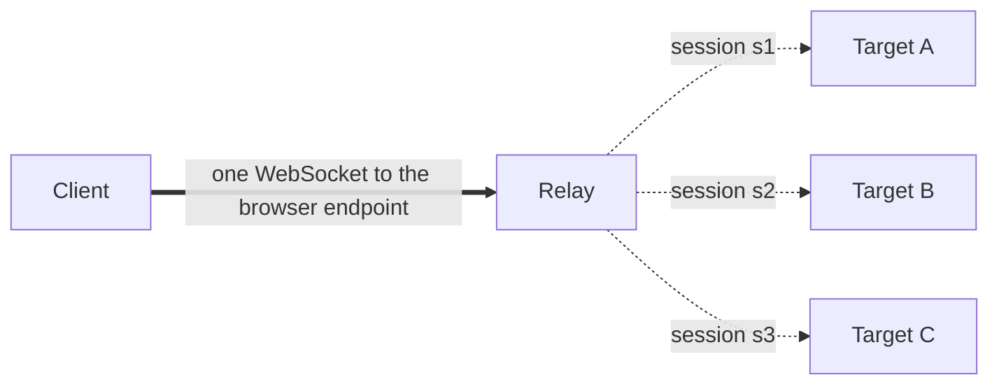

# The flat-session protocol

A [Client](/explanation/concepts) attaches to an icdp [Relay](/explanation/concepts) exactly the way a modern CDP client attaches to Chrome: it opens one WebSocket to the browser-level endpoint, discovers [Targets](/explanation/concepts) over that connection, and routes every per-target command by `sessionId`. There is no other shape. This page explains why icdp commits to that single shape, which methods the Relay answers without ever touching a [Frame Agent](/explanation/concepts), and why the supported command surface stops where it does.

## One endpoint, sessions on top

CDP has two historical addressing models. The legacy model gives every target its own `webSocketDebuggerUrl`: a client reads `/json/list`, picks a target, and opens a fresh socket whose every frame is implicitly scoped to that target. The flat-session model gives a client one socket — the browser-level endpoint — over which it calls `Target.attachToTarget` to get a `sessionId`, then tags each per-target command with that `sessionId`. One connection multiplexes work across many targets.

icdp implements only the flat-session model.



*One WebSocket (thick) carries many logical Sessions (dotted); each is addressed by its own `sessionId`, never by a per-target socket.*

There are no per-target WebSocket URLs. The Relay's HTTP discovery payloads make this explicit: every entry in `/json/list` reports the same `webSocketDebuggerUrl` — the one browser endpoint — and a Client is expected to attach there with `Target.attachToTarget` rather than dial a target directly. See [HTTP endpoints](/reference/http-endpoints) for the discovery payloads and [the Relay reference](/reference/relay) for the full method behavior.

The choice falls out of the topology. An icdp "target" is a [Pairing](/explanation/concepts): a [Host](/explanation/concepts)-side slot occupied by an iframe, reachable only through the bridge to the Host and from there a `MessagePort` into the frame. There is no per-target listening socket to expose, because a target is not a process with its own debugging port — it is a slot in a hub. Modeling each Pairing as a flat session, rather than a URL, keeps the wire protocol honest about what a target actually is: a `targetId` the Host can pair, navigate, and unpair while its identity stays fixed (see [Target lifecycle](/explanation/target-lifecycle)). It also matches what current tooling already speaks; the [compatibility bar](#the-compatibility-bar-agent-browser), agent-browser, drives Chrome over flat sessions too.

## Who answers what

A command crossing the Relay lands in one of three places. The split is not arbitrary: it follows from who actually holds the state needed to answer.

**The Relay answers registry and housekeeping methods itself.** Target discovery, attachment, and the small browser-level RPCs read or mutate the Relay's *own* bookkeeping — its map of known targets, its per-Client session set, the auto-attach and discover flags on each connection. The Frame Agent has no notion of targets at all; it sees one document and dispatches DOM commands against it. So these methods never leave the Relay:

| Method | Why the Relay owns it |
| --- | --- |
| `Target.getTargets` | Reads the Relay's target map. |
| `Target.getTargetInfo` | Reads the Relay's target map. |
| `Target.attachToTarget` | Mints a `sessionId` and records the Session. |
| `Target.detachFromTarget` | Ends a Session the Relay tracks. |
| `Target.setAutoAttach` | Flips a per-Client flag; attaches existing targets. |
| `Target.setDiscoverTargets` | Flips a per-Client flag; replays `Target.targetCreated`. |
| `Target.setRemoteLocations`, `Target.activateTarget` | No-ops over a hub with no remote locations or focus. |
| `Browser.getVersion` | Identity synthesized from the Relay's `product`. |
| `Schema.getDomains` | Returns an empty domain list (`{ domains: [] }`). |
| `Browser.close`, `Browser.setDownloadBehavior`, `Browser.setWindowBounds`, `Security.setIgnoreCertificateErrors` | Browser-singleton RPCs answered as no-ops. |

Most of these are answered at the browser level (no `sessionId`). A subset that real clients send *inside* a session — `Browser.getVersion`, `Schema.getDomains`, `Target.getTargetInfo`, `Target.setAutoAttach`, `Target.setDiscoverTargets`, `Target.setRemoteLocations`, `Target.activateTarget` — is also answered session-scoped: agent-browser, for instance, sends `Target.setAutoAttach` within a session, so the Relay handles it there. A Session-routed command is first checked against this session-level housekeeping set; only if it is not housekeeping does it become a `command` on the bridge to the Host.

**The Frame Agent answers everything else.** Any session-scoped method that is not Relay housekeeping is forwarded — unchanged — to the Host, which routes it over the `MessagePort` to the Frame Agent. The agent dispatches it through [chobitsu](https://github.com/liriliri/chobitsu) plus icdp's registered domain handlers, against the real DOM. `DOM.getDocument`, `Accessibility.getFullAXTree`, `Input.dispatchMouseEvent`, `Runtime.evaluate`, and the rest of the [supported surface](/reference/cdp-support) all execute here. An unknown method returns a CDP error (`-32000`, `Method not found: <method>`).

**Only the target *lifecycle* can be delegated to the Host.** Two browser-level methods are special: `Target.createTarget` and `Target.closeTarget`. Out of the box, creation is rejected (`Target.createTarget is not supported: icdp targets are iframes paired by the Host`) and close is a `{ success: true }` no-op, because the default contract is that the Host alone opens Targets via `pair()`. But a Host that wires up `onCreateTarget` / `onCloseTarget` advertises those methods in its ready handshake (the `handles` field), and the Relay then *forwards* exactly those to the Host as a `browserRequest`, awaiting the result (bounded by `browserRequestTimeoutMs`, default 30000 ms). This is the complete set of forwardable browser methods:

```ts
const FORWARDABLE_BROWSER_METHODS = new Set(["Target.createTarget", "Target.closeTarget"]);
```

The list is deliberately closed to these two. A Host cannot take ownership of `Target.getTargets` or `Target.attachToTarget`, because those read the Relay's own session and target state — state the Host does not hold and could not answer correctly. Lifecycle is the one concern the Host genuinely owns (it is the thing that creates and destroys iframes), so lifecycle is the one thing it can claim. See [Client-driven target lifecycle](/guides/client-driven-targets) for the walkthrough and [the protocol reference](/reference/protocol) for the bridge message shapes (`BridgeReady`, `BridgeBrowserRequest`, `BridgeBrowserResult`).

## Events fan out by Target, not by socket

Because targets are sessions rather than sockets, an event from a frame cannot be addressed to a connection — it must be addressed to whoever is attached. When the Frame Agent emits an event, the Host forwards it to the Relay as a `BridgeEvent` carrying a `targetId`; the Relay then fans it out to *every* Session attached to that Target, stamping each copy with that Session's `sessionId`. One frame event becomes one delivery per attached Session. Registry-level notifications follow the flat-session contract too: `Target.targetCreated` / `Target.targetDestroyed` go only to Clients that opted in with `Target.setDiscoverTargets`, and `Target.attachedToTarget` is what a Client receives when `Target.setAutoAttach` adopts a Target on its behalf.

## The compatibility bar: agent-browser

icdp does not aim to be a complete CDP implementation. Its compatibility bar is the support matrix of the prior art it was built to replace, agent-browser: AX-tree snapshots, semantic locators, click / fill / type, eval, waits, console, and SPA history. The Frame Agent registers precisely the domains and methods that bar requires, and no more — [the support matrix](/reference/cdp-support) enumerates every one.

Everything above that line is forwarded to the frame and answered against the real DOM. Some capabilities sit permanently below it, not because they were skipped but because page JavaScript inside an iframe *cannot* synthesize them: screenshots, PDF, file uploads, drag-and-drop, dialogs, and real network interception have no DOM-only implementation. They are intentionally out of scope rather than partially faked.

This bounds what an arbitrary CDP client can expect. agent-browser, driven over the per-command `--cdp` flag, stays inside the matrix and works. Raw Playwright over `connectOverCDP` exercises a much wider protocol surface, so it is best-effort: the methods that map onto the supported domains succeed, and the rest return a `-32000` `Method not found`. The flat-session protocol is the contract; the support matrix is the menu within it.
