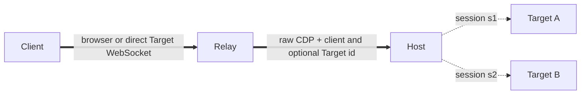

# The flat-session protocol

icdp exposes Chromium's two common connection shapes. A
[Client](/explanation/concepts) can connect to the browser WebSocket, call
`Target.attachToTarget` with `flatten: true`, and put the returned `sessionId`
on Target commands. A Client can instead connect to the
`webSocketDebuggerUrl` of one `/json/list` entry and send that Target's
commands without a `sessionId`.


```mermaid
flowchart LR
    C["Client"] ==>|"browser or direct Target WebSocket"| R["Relay"]
    R ==>|"raw CDP + client and optional Target id"| H["Host"]
    H -. "session s1" .-> A["Target A"]
    H -. "session s2" .-> B["Target B"]
```

`/json/version` advertises the browser WebSocket. Each `/json/list` entry
advertises a distinct `/devtools/page/<targetId>` WebSocket. Both routes create
ordinary Host Sessions; only their wire addressing differs.

## The Host owns Target agents

The Relay cannot answer CDP methods: it deliberately does not parse them.
The Host owns the Client and Target registries and implements this surface for
the browser root, direct page connections, and explicit flat Sessions:

| Method | Behavior |
| --- | --- |
| `Browser.getVersion` | Returns the configured product and protocol `1.3`. |
| `Target.getTargets` | Returns the Host's current Pairings as page Targets. |
| `Target.getTargetInfo` | Returns one Target, selected by `targetId` or the current Session. |
| `Target.setDiscoverTargets` | Toggles lifecycle events independently for the requesting Target agent and replays existing Targets when enabled. |
| `Target.setAutoAttach` | Requires `flatten: true`; the browser agent creates/removes auto-attached Sessions for top-level Pairings. |
| `Target.attachToTarget` | Requires `flatten: true`; creates a child Session of the requesting Target agent. |
| `Target.detachFromTarget` | Ends a direct child Session of the requesting Target agent. |
| `Target.createTarget` | Calls `onCreateTarget`; fails when the Host has no hook. |
| `Target.closeTarget` | Calls `onCloseTarget`; fails when the Host has no hook. |
| `Target.setRemoteLocations` | Returns `-32000`, `Not supported`. |

Each attached Session has its own Target-agent state. Responses and Target
events generated from an explicit Session carry that outer `sessionId`.
Discovery and auto-attach settings therefore do not overwrite the browser
root's settings. Page Target agents can enumerate and explicitly attach other
Pairings, matching Chromium, but do not auto-attach unrelated top-level
Pairings. Only the Target agent that created a child may detach it; ending a
parent recursively ends its descendants. Chromium reports only the requested
child's `Target.detachedFromTarget`, followed by any attached-state change and
the command response; descendant detach events and pending-command errors are
suppressed.

An unknown Host-domain method returns `-32601`. A Frame method sent without a
`sessionId` on the browser endpoint is rejected with a message telling the
Client to attach first.

## Direct Target sockets

A direct Target connection gives the Client one unannounced implicit Session.
Target commands and events omit `sessionId`, matching Chromium's page
WebSocket. Browser and `Target` methods remain Host-level; for example,
`Browser.getVersion`, `Target.getTargets`, and `Target.getTargetInfo` work
without being forwarded into the iframe.

The Client may still create explicit flattened Sessions with
`Target.attachToTarget`. Those nested responses and events retain their
`sessionId`. The implicit Session cannot be detached with
`Target.detachFromTarget`; it ends when the socket closes or the Target is
destroyed. It is nevertheless a distinct Target agent: discovery and
auto-attach configuration on the direct socket does not mutate browser-root
state.

When a Target is destroyed, flattened Sessions receive `Inspector.detached`
before surviving discovery agents receive `attached: false` Target changes
and before the parent agent receives `Target.detachedFromTarget`. Descendants
of a destroyed Target agent end silently, even if they inspect another live
Target, and their pending commands receive no late response. A direct socket
receives the close response followed by unscoped `Render process gone.` and
`target_closed` Inspector reasons before the Relay closes it.

## Session isolation

The Host records the owner, Target, enable state, and Frame command mapping
for every Session. It rejects a Client that attempts to use another Client's
`sessionId`.

On attachment the Host sends:

```ts
{
  kind: "attach",
  sessionId,
  state: { enabledDomains: [], domainParams: {} },
}
```

Every subsequent command and event carries that Session id through the
Host–Frame boundary. Domain `.enable` and `.disable` calls update only that
Session after a successful Frame response. The Frame Agent therefore emits
`Runtime.consoleAPICalled`, Page lifecycle, Network, DOM, and Accessibility
events only to Sessions that enabled the relevant domain.

This differs from a Target-wide broadcast: two Sessions attached to one
iframe have independent DOM node ids, Runtime object handles, domain state,
and event streams.

## Reload behavior

A Target outlives its current document. When the Frame Agent re-announces
after a reload, the Host:

1. fails commands still pending against the old document;
2. replaces the `MessagePort`;
3. keeps the Target and Session ids;
4. sends a new `attach` message for every Session, including that Session's
   enabled domains and accepted enable-time parameters.

The new Frame backend recreates document-scoped identity. Old DOM node ids and
Runtime object handles are intentionally invalid after replacement.

## Relay behavior

The Relay only:

- assigns an opaque id to each Client socket;
- sends the Host a complete current Client-id snapshot, plus the Target id for
  direct sockets;
- wraps raw CDP JSON with the Client id in either direction;
- caches Host-provided Target summaries for HTTP discovery;
- rejects a Client command with `-32000` when no Host is connected.

This narrow boundary keeps CDP semantics in one place: the Host.

## Availability

Frame commands are limited to the exact current
[CDP support list](/reference/cdp-support). Unsupported methods return
`-32601`; invalid envelopes and parameters use Chromium's JSON-RPC-style
`-32700`, `-32600`, and `-32602` errors. There are no successful no-op
handlers for unimplemented browser features.
