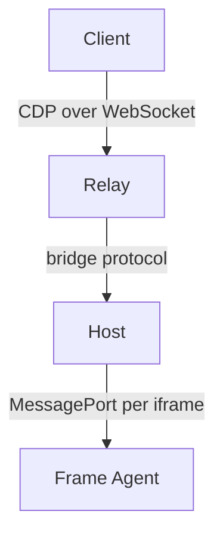

## The topology

icdp threads a single CDP conversation across an iframe boundary. A Client speaks
standard CDP to the Relay; the Relay bridges to the Host; the Host fans sessions
out to one Frame Agent per iframe.

## Which page do I want?

| If you want to…                                   | Go to                                  |
| ------------------------------------------------- | -------------------------------------- |
| **Learn** icdp by driving a running demo          | [Tutorial](/tutorial/)                 |
| **Solve** a specific task (embed, pair, relay, …) | [How-to Guides](/guides/)              |
| **Look up** an exact type, method, or default     | [Reference](/reference/)               |
| **Understand** why icdp is shaped the way it is   | [Explanation](/explanation/)           |

::: tip New here?
Start with the [tutorial](/tutorial/) — it boots the bundled playground and drives
a real cross-origin iframe end to end in a few minutes, then points you at the
guide or reference page for whatever you reach for next.
:::
