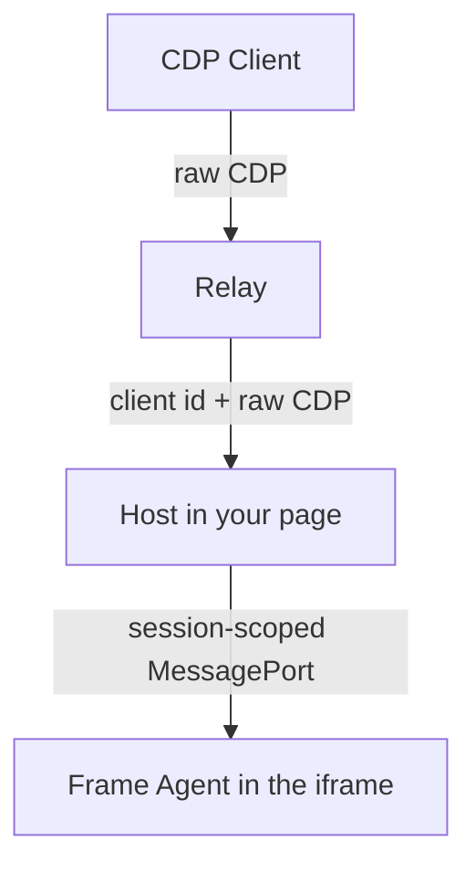

## How it works

A CDP automation tool drives an app running inside an iframe, including a
cross-origin one, with no browser debugging session. The Relay carries raw CDP;
the Host owns Targets and Sessions; the embedded Frame Agent implements the
document-facing subset against its own live DOM.

```mermaid
flowchart TD
    C["CDP Client"] -->|"raw CDP"| R["Relay"]
    R -->|"client id + raw CDP"| H["Host in your page"]
    H -->|"session-scoped MessagePort"| F["Frame Agent in the iframe"]
```

## Try it live

The demo uses **agent-browser compiled to WebAssembly** as one real CDP Client.
It drives the iframe through icdp entirely inside this page; the library itself
remains Client-independent.

<ClientOnly>
  <LiveDemo />
</ClientOnly>

## Which page do I want?

| If you want to…                                   | Go to                                  |
| ------------------------------------------------- | -------------------------------------- |
| **Learn** icdp by driving a running demo          | [Tutorial](/tutorial/)                 |
| **Solve** a specific task (embed, pair, relay, …) | [How-to Guides](/guides/)              |
| **Look up** an exact type, method, or default     | [Reference](/reference/)               |
| **Understand** why icdp is shaped the way it is   | [Explanation](/explanation/)           |

::: tip New here?
Start with the [tutorial](/tutorial/) — it boots the bundled playground and drives
a real cross-origin iframe end to end in a few minutes, then points you at the
guide or reference page for whatever you reach for next.
:::
